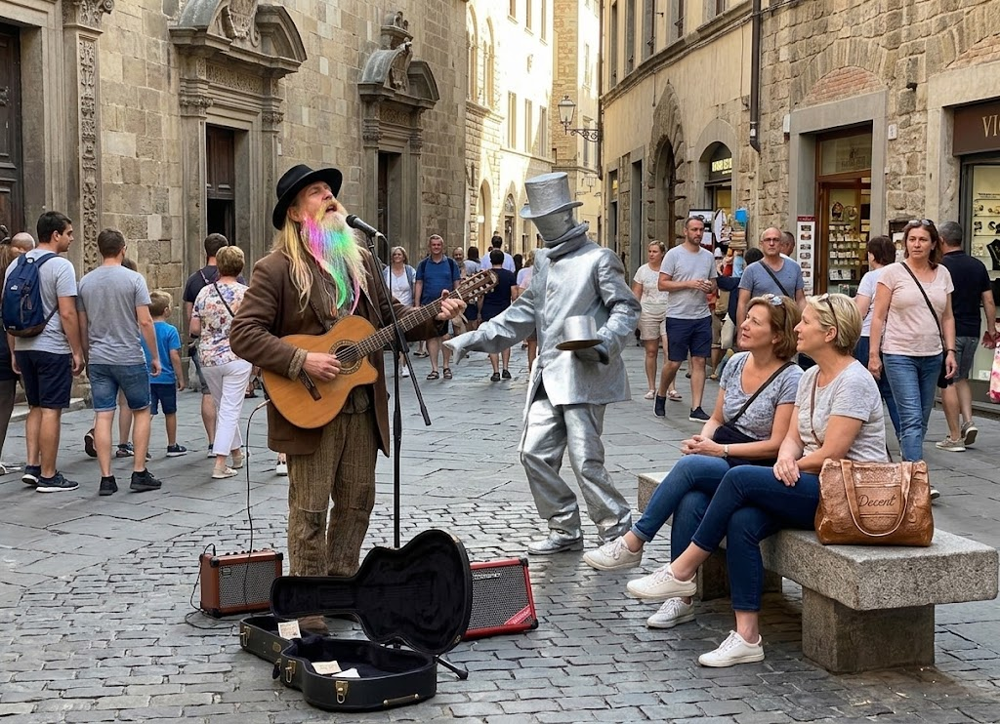

# DecentBusking

**Drop a track. Join the loop. Mint it when you’re ready.**

DecentBusking is a community listening room, a 3D timeline of music NFTs, and a Discord radio built around the people who make the music. Listen, explore the archive, tip a performer, or bring a track into JukeLoop.

<p align="center">
  <a href="https://thejollylama.github.io/DecentBusking/"></a>
</p>

## Come Listen

Open the [DecentBusking town square](https://thejollylama.github.io/DecentBusking/) and explore the 3D music timeline. Select a track in the archive to listen, inspect its NFT details, and tip the artist. Connect MetaMask on Base when you want to send a tip.

Join [DecentBusking on Discord](https://discord.gg/SCtcBggHPa), head to **#DecentJukebox**, and tune in to the **JukeLoop** voice channel. The radio rotates community uploads; listeners can react 👍 or 👎. The bot tracks cumulative votes and plays, and the ratings influence future rotation.

## Bring A Track

Post an audio file in **#DecentJukebox**. The bot adds it to the JukeLoop playlist and pins it to IPFS; no personal Pinata account or IPFS setup is needed.

To request a DecentNFT:

1. Run `/jukebox backlog` and copy the track ID for your upload.
2. Run `/jukebox request-mint` with that track ID and the Base wallet that should receive the NFT and royalties.
3. Optionally attach PNG, JPEG, WebP, or GIF artwork up to 10 MB. The bot pins it to IPFS, and the owner sees it preloaded in the mint queue. The owner can replace it before minting.

Example:

```text
/jukebox request-mint track_id:<your-track-id> wallet:<your-Base-address> artwork:<optional-image>
```

The bot replies privately to confirm the request. That means **queued, not minted**. The NFT is minted only after an authorized collection owner approves it.

## Owner Mint Queue

The contract owner opens **Admin** from the DecentBusking header menu, connects the `DEFAULT_ADMIN_ROLE` wallet on Base, and signs to load pending community requests. The queue shows the artist, destination wallet, track, and submitted artwork. Owners can mint requests one at a time or select several for sequential processing.

The current contract has no atomic batch method, so each track requires two Base confirmations: register the product, then mint one edition directly to the artist. The owner wallet authorizes the transactions and pays gas; it does not keep the artist’s NFT. After confirmation, the bot verifies the Base transaction, updates the durable queue, and announces the minted NFT in Discord.

## DecentNFT On Base

DecentBusking music NFTs use the DecentNFT v0.2 ERC-1155 contract on Base Mainnet:

- Contract: [`0xe63EC9f8228720bAAC2fD528C0A6d06B3Dc5439B`](https://basescan.org/address/0xe63EC9f8228720bAAC2fD528C0A6d06B3Dc5439B)
- Network: [Base Mainnet](https://basescan.org/)
- Metadata and audio: IPFS, pinned through the DecentBusking service
- Artwork: optional IPFS image included in the NFT metadata
- Current royalty: 5% ERC-2981 royalty receiver set to the artist wallet

Minted music appears in the DecentBusking 3D timeline and archive for listening and selection. Marketplace purchase, resale, and richer multi-artist royalty splits are still being developed; a DecentMarket link does not necessarily mean a track is currently listed for sale. Follow the [DecentNFT v0.3 plans](https://github.com/TheJollyLaMa/DecentMarket/issues/47) for restricted creator minting, atomic batch minting, and expanded royalty support.

## How It Works

- **JukeLoop:** Discord voice radio plays community tracks and applies vote-weighted rotation.
- **3D archive:** Base music NFTs are placed on a timeline by mint date; select an archive entry to listen and view details.
- **Pinata + IPFS:** Audio, artwork, and metadata use the shared upload service. The bot checkpoints playlist, vote, and mint-queue state to IPFS so the Render free-tier service does not require a persistent disk.
- **Owner controls:** The dapp Admin panel handles the mint queue. Discord `/jukeloop restart` can reconnect the radio; `/jukeloop stats` shows top-rated tracks.

## Build With Us

Everyone is welcome: code, testing, documentation, art, accessibility, and ideas all help make the town square better. Browse [open issues](https://github.com/TheJollyLaMa/DecentBusking/issues), ask to be assigned, and link your pull request with `Closes #N`.

Contributor rewards may be available in ART or USDC from the Base `dbusk-repo-dev` fund. See [Contributor Payroll](docs/PAYROLL.md) and the [Contributor Request form](https://github.com/TheJollyLaMa/DecentBusking/issues/new?template=whitelist-request.yml).

## Run Locally

```sh
npx serve .
```

The static dapp can be explored without a wallet. Connect MetaMask on Base for wallet features. Local IPFS upload can use Kubo/IPFS Desktop; production uploads use the Render service and Pinata.

## Links

- [Listen in the DecentBusking town square](https://thejollylama.github.io/DecentBusking/)
- [Join the Discord community](https://discord.gg/SCtcBggHPa)
- [View DecentNFT on BaseScan](https://basescan.org/address/0xe63EC9f8228720bAAC2fD528C0A6d06B3Dc5439B)
- [DecentMarket](https://thejollylama.github.io/DecentMarket/)
- [DecentBusking issues](https://github.com/TheJollyLaMa/DecentBusking/issues)
- [DecentMarket v0.3 contract plans](https://github.com/TheJollyLaMa/DecentMarket/issues/47)
