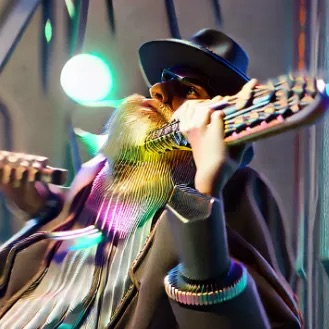

# DecentBusking

**A Web3 town square for live sound, generous tips, and busker-made audio NFTs.**

<p align="center">
  
</p>

Come listen, leave a tip, share a recording, or help build the stage. **The town square is better when more people show up.**

## Play

Visit the [DecentBusking town square](https://thejollylama.github.io/DecentBusking/) to explore the sound field, open a track, and listen. Connect a wallet to tip a performer or explore the NFT marketplace.

Join the [Discord](https://discord.gg/5XJtJYdhz) to share audio in **#DecentJukebox** and join the JukeLoop community radio. When the upload flow is enabled, tracks are pinned to IPFS and shared to the radio playlist; an optional mint link is provided for eligible tracks.

## Busk

<p align="center">
  
</p>

Bring your own sound. Connect IPFS from the site, open the guitar case, and add a recording to the town square. Audio NFTs are minted on Optimism. Minting is currently permissioned, so a platform-authorized wallet is required; opening up self-service artist minting is a welcome contribution.

## Contribute

Everyone is invited to help: pick an issue, ask to be assigned, and open a pull request that links it with `Closes #N`. Testing, documentation, art, accessibility, and ideas are all part of building the stage.

Use the [Contributor Request form](https://github.com/TheJollyLaMa/DecentBusking/issues/new?template=whitelist-request.yml) to share your GitHub handle, wallet, and what you’d like to work on. Bountied contributions can earn ART or USDC from the dedicated `dbusk-repo-dev` fund on Base. See [Contributor Payroll](docs/PAYROLL.md) for the short version of how rewards work.

## Run Locally

```sh
npx serve .
```

Open the local URL, connect your wallet and IPFS account, and explore. DecentBusking’s stage and NFT contracts use Optimism; contributor payroll uses Base.

## Links

- [Open the town square](https://thejollylama.github.io/DecentBusking/)
- [Join Discord](https://discord.gg/5XJtJYdhz)
- [Browse issues and contribute](https://github.com/TheJollyLaMa/DecentBusking/issues)
- [DecentMarket](https://github.com/TheJollyLaMa/DecentMarket)
