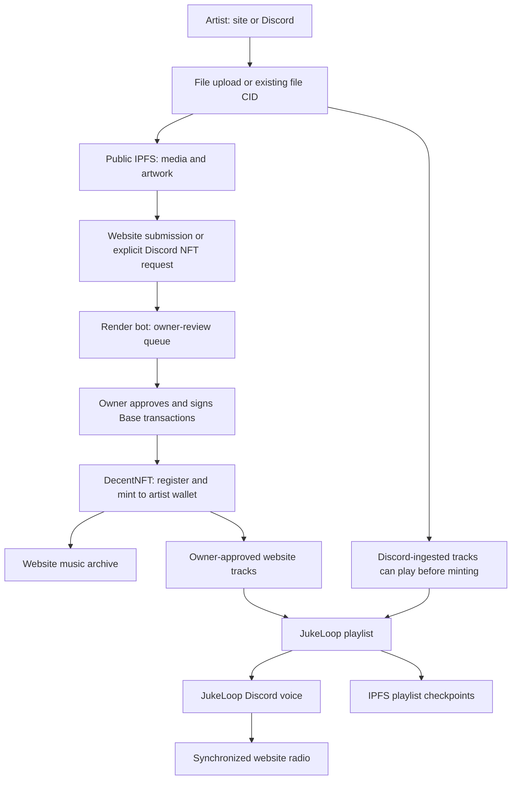
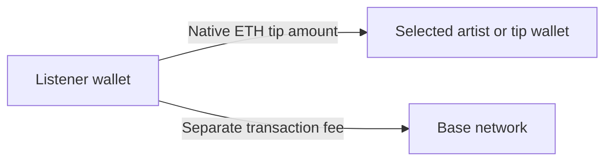

# Decent Busking Whitepaper

**A digital town square for music, direct artist support, and accountable community radio.**

Version 0.3 | 8 October 2026 | Implementation-grounded working document

This paper describes the current DecentBusking implementation and its intended development direction. It is not an independent security audit, a rights licence, a token offering, or a promise of investment returns. Features marked as planned are not available merely because they appear here. Configuration and deployed software can change; source files and on-chain records should be checked when making operational decisions.

## Contents

1. [Executive Summary](#1-executive-summary)
2. [Problem And Design Principles](#2-problem-and-design-principles)
3. [The Ecosystem](#3-the-ecosystem)
4. [Technical Architecture](#4-technical-architecture)
5. [Economics And Payment Mechanics](#5-economics-and-payment-mechanics)
6. [Artist Rights And Public Storage](#6-artist-rights-and-public-storage)
7. [Trust, Security, And Operational Limits](#7-trust-security-and-operational-limits)
8. [Roadmap And Funding Priorities](#8-roadmap-and-funding-priorities)
9. [Stewardship And Community](#9-stewardship-and-community)
10. [Implementation References](#10-implementation-references)

## 1. Executive Summary

Decent Busking brings the social experience of busking into a web-native listening space: artists share music, listeners discover and support performers, and community radio keeps the archive in circulation. The website combines a three-dimensional music NFT timeline, individual recording playback, a synchronized radio player, direct wallet tips, and public activity tallies. Discord provides the community's upload channel and voice-radio venue.

The project uses Web3 selectively. Base records music tokens and treasury payments. IPFS gives media and metadata content-addressed references. Wallets provide artist destinations and authorize transactions. These tools make important records inspectable and portable; they do not make every part of the service decentralized or confer copyright through token ownership.

The current platform is a **hybrid, owner-operated system**, not a permissionless minting network or autonomous royalty distributor. A Discord bot and Render service manage playback, observations, uploads, and reconciliation. The owner approves NFT requests and authorizes funded payroll. The aim is to make these responsibilities visible rather than obscure them behind decentralization claims.

Artists can receive music NFTs at their chosen Base wallets and direct ETH tips without a platform deduction in the implemented tipping path. Eligible community activity may be included in owner-reviewed payments from funded allocations. Neither uploading, minting, voting, nor accumulating plays guarantees income. The development priority is a transparent, understandable system that gives participants informed choices about public sharing and financial actions.

## 2. Problem And Design Principles

Physical busking connects a performer to nearby listeners, but reach is constrained by place and time. Digital publishing expands that reach while often separating the recording, audience relationship, discovery process, and payment record across different services. A small independent artist may have difficulty knowing how a track was discovered, what activity was recorded, and whether a payment actually happened.

Decent Busking does not claim to remove all intermediaries. It combines familiar community tools with independently inspectable payment and media references to reduce those information gaps.

The design principles are:

- **Listen before transacting.** Exploring the website and listening do not require a wallet or payment.
- **Artist-directed support.** The direct-tip path sends the entered native-token amount to the selected recipient wallet.
- **Separate facts from promises.** Plays, votes, payout proposals, confirmed transfers, and copyright permissions are different records.
- **Make authority visible.** Owner approval, server operations, gateway dependence, and treasury roles must be disclosed.
- **Preserve history.** New weekly counters must not erase lifetime totals; resumed payment queues must not repay confirmed work references.
- **Use bounded budgets.** Payments require reviewed recipients, sufficient funds, and wallet authorization rather than assumed future revenue.

The value of Web3 here is verifiable transaction settlement and content-addressed references, not a guarantee of censorship resistance, permanent availability, legal ownership, or low fees in every circumstance.

## 3. The Ecosystem

### Three Connected Surfaces

| Surface | Current purpose |
| --- | --- |
| **DecentBusking** | Browser experience for radio, a music NFT timeline/archive, song details, direct tips, submissions, and public/personal tallies. |
| **#DecentJukebox** | Discord channel for community media uploads and bot-assisted NFT requests. |
| **JukeLoop** | Continuous, rating-weighted community playback in Discord voice, with synchronized playback on the website. |

### Artist Submission And Archive

The site accepts supported audio and MP4 files up to 50 MB, or an existing IPFS file CID. The Discord attachment flow is bounded at 10 MB. Artwork is optional. Site submissions and explicit NFT requests enter an owner-review queue; they do not automatically mint. Discord ingestion and radio discovery are separate from the NFT-request step.

Discord NFT requests, including media-CID submissions, default to a pinned copy of the uploader's Discord profile image; animated profile images are retained when available. Admin previews the queued artwork and can replace it with PNG/JPEG/WebP/GIF up to 10 MB or an existing image/GIF file CID with no attachment-size cap. CID selection references an already-uploaded file rather than uploading it again; parsing the CID does not guarantee its image type, gateway availability, pin retention, or efficient rendering. Native file selectors cannot be prefilled with a profile image, so the preview shows the default separately. Website-only submissions do not establish a Discord identity and cannot infer its profile image.

For approved requests, the owner registers a DecentNFT product and mints an edition directly to the chosen artist wallet. The archive reads minted tokens and their metadata from Base/IPFS. The current mint workflow uses separate registration and mint transactions, not an atomic multi-artist mint batch. MP4 playback is audio-only in Discord voice; the site can display synchronized video.

The guitar case opens submissions; the hat opens tipping. The Left Ankh exposes the public Playback Tally, while the Right Ankh's My Playbacks opens the connected artist wallet's tally. Owner-only Admin and Payroll controls are distinct from ordinary listener tools.

### Audience Participation

Discord reactions and website votes update a shared track tally. Repeated Discord count snapshots apply their delta rather than adding the same observations again. Website votes are limited per browser and active play. Ratings affect rotation, but public browser identities are not proof of unique humans.

A qualified playback event requires at least 30 audible seconds of completed Discord playback and an idempotent play identifier. New payout buckets close Monday at 00:00 in `America/New_York`, with daylight-saving transitions handled by timezone data. Previous UTC buckets and all-time totals remain intact. New York accounting starts at deployment; its first week is labelled partial rather than inventing timestamp detail for old UTC aggregates. A new week starts at zero without deleting old buckets. Historical recovery can restore conservative lifetime totals without manufacturing past weekly prize eligibility.

## 4. Technical Architecture

### Implementation Stack

| Layer | Current implementation | Important boundary |
| --- | --- | --- |
| Website | Static HTML/CSS/JavaScript, ES modules, custom elements, Three.js music space; GitHub Pages | External CDN assets and RPC/gateway availability affect the experience. |
| Wallet interaction | EIP-1193 browser provider and ethers; tested paths use MetaMask | Other wallets are not certified simply because they expose a provider. |
| Music tokens | DecentNFT v0.2, ERC-1155 on Base Mainnet | Owner-approved registration/minting; token ownership is not copyright ownership. |
| Treasury | Shared ArtFi Settlement Router on Base | Role-controlled fund creation, recipient approvals, and payouts. |
| Community service | Node.js Discord bot and HTTP worker on Render | Centralized execution, observation, scheduling, and upload authorization. |
| Media persistence | Public IPFS media/metadata pinned through Pinata; local Kubo adapter for development | Content addressing is not a permanence or access-control guarantee. |
| Accounting | Playlist checkpoints, frozen allocation receipts, verified payment snapshots, GitHub repo ledger | Each record has a different purpose and must be reconciled accordingly. |

### Network And Contracts

Active music NFTs, direct tips, and token payroll use **Base Mainnet, chain ID 8453**. Optimism records remain historical, including retired ETH payroll and earlier supporter-edition references; they are not converted into new Base obligations or silently paid again. The current About interface describes a future Base supporter edition, not an active purchase route for the old Optimism editions.

| Contract / asset | Configured Base address |
| --- | --- |
| DecentNFT v0.2 | [`0xe63EC9f8228720bAAC2fD528C0A6d06B3Dc5439B`](https://basescan.org/address/0xe63EC9f8228720bAAC2fD528C0A6d06B3Dc5439B) |
| ArtFi Settlement Router | [`0x8ecca903e2a6Daa8CCbB933700e4F2C58C44A4B5`](https://basescan.org/address/0x8ecca903e2a6Daa8CCbB933700e4F2C58C44A4B5) |
| Native Base USDC | [`0x833589fCD6eDb6E08f4c7C32D4f71b54bdA02913`](https://basescan.org/address/0x833589fCD6eDb6E08f4c7C32D4f71b54bdA02913) |
| Configured ART payout asset | [`0x44c4516768e47cd97cfF2561B81a74699F23f8Ec`](https://basescan.org/address/0x44c4516768e47cd97cfF2561B81a74699F23f8Ec) |

These addresses are implementation references, not endorsements of an asset's value or a claim that every contract has been independently audited.

### Submission And Data Flow

The radio is not a browser-to-browser peer-to-peer streaming protocol. Discord voice and HTTPS IPFS gateways are part of the delivery path. Pinata is the current production upload/pinning provider; Lighthouse is not an implemented storage layer.

### Payment Proof Flow

The worker's public `GET /api/payroll/ledger` endpoint exposes payment records, verification state, scan coverage, and the latest IPFS snapshot URI. Browser-confirmed payouts can be submitted immediately for independent reconciliation. The worker checks successful Base receipts, canonical block hashes, two confirmations, and the exact router `PayrollPaid` event in DecentBusking's repository namespace.

The comparator runs every 15 seconds, using bounded scan chunks and rotating proof checks. Open Payroll/Admin panels refresh shared status every five seconds. JukeLoop radio state advertises the ledger endpoint. Separate DJuke/DBusk consumers must explicitly integrate it; no unknown external service or token contract is changed automatically.

An explicit historical start block or restored checkpoint determines scan coverage. Without either, discovery begins 2,000 blocks behind startup head. This is not a complete lifetime audit claim. Older known hashes can be reconciled directly. RPC, network, and service failures can delay convergence; the system does not promise instantaneous finality.

## 5. Economics And Payment Mechanics

### Direct Tips

The implemented hat flow sends **native ETH on Base** directly from the connected listener wallet to the selected recipient. It does not route that tip through the payroll contract or deduct a platform fee. The sender separately pays network gas. This statement describes the current code path, not a promise that all external marketplaces or future payment routes are fee-free.

The user must check the destination and amount. A wallet broadcast is not the same as a successful receipt; the transaction link is the source for confirmation. The current direct-tip handler is not a general ERC-20 tipping implementation.

### Separate Fund Allocations

The shared router uses distinct DecentBusking funds: `dbusk-playback`, `dbusk-top10`, and `dbusk-repo-dev`. An authorized router admin can create a custom purpose fund using a slug-derived ID and public IPFS purpose metadata. Creating a fund does not deposit funds, enable payouts, or attach that fund to a new reward policy.

The USDC deposit workflow checks the configured owner, network, asset, fund activity, token balance, and allowance. It requests an approval for the intended deposit rather than an unlimited allowance when approval is needed. Approval and deposit are separate transactions; depositing into a fund is not an artist payment.

The owner-only recovery control calls the deployed router's `recoverFund` to return a selected amount of remaining native Base USDC to the configured owner wallet. It requires router admin permission, checks actual/fund balances, preflights the transaction, and verifies exact `FundRecovered` and USDC `Transfer` events. Unresolved operations remain locally locked until receipt review. Recovery can work while paused or inactive, but can reduce funding for unpaid proposals. This is not wallet-equivalent custody or a refund of already-paid money.

### Playback And Top 10 Payments

Playback drafts group eligible qualified weekly plays by verified artist wallet and distribute the selected USDC budget proportionally in integer token units. Each artist's provisional share is rounded down. Shares below the chosen minimum and rounding remainder stay unallocated in the fund; they do not automatically become artist debt.

New Top 10 drafts rank artist wallets by positive weekly net votes: upvotes minus downvotes, with ties ordered by wallet address. Up to ten artist wallets share the reviewed prize budget equally. An artist receives at most one place. Lifetime votes and historical backfill are not retroactively assigned to a prize week. Older play-ranked receipts remain historical receipts with their original replay-protection identities.

After a New York week closes, the running worker automatically prepares IPFS allocation receipts and a retained schedule checkpoint. The default policy offers 100% of unreserved funds, a 0.01 USDC payout minimum, and a warning when average provisional shares are below 1 USDC. Policy values live in `payroll-assets.json`. Budgets are capped by verified closing-block balances and current unreserved money, so later deposits cannot retroactively enlarge an old week. Unpaid receipts are reserved in service accounting; this is not an enforceable on-chain escrow reservation. RPC/IPFS failures stop preparation rather than producing payable guesses. A stopped or sleeping service catches up when running again; there is no guaranteed exact-second execution.

The owner reviews the prepared recipients and amounts, approves missing recipients separately, and authorizes each payout. No server signing key or automatic transfer is introduced. Existing UTC receipts remain importable; payments with overlapping legacy paid references require manual reconciliation. The dashboard and My Playbacks display current fund balances, estimated artist/song contributions and warnings, not debt or a claimable balance. Current multi-artist batches are resumable sequences of wallet transactions; the router's `payoutBatch` groups multiple work items for one recipient, not many artists in one transaction.

Work-reference replay protection skips confirmed payments when resuming the same receipt. It does not freeze a station-wide weekly budget on-chain or prevent the owner from authorizing different new recipients across conflicting receipts. The original reviewed receipt should be retained throughout partial settlement.

### Repository Contributor Rewards

Approved GitHub bounty work can enter a separate repo-dev queue after a qualifying merge or testing approval. Configured payout labels include ART and USDC. The issue, contributor, role, currency, and work reference determine the entry; informal participation is not automatically paid.

The owner-only Settle Payroll workflow verifies the exact Base fund, asset, recipient, amount, work reference, repository, and contributor before modifying queue/account files. Automatic worker dispatch requires a server-only owner credential, `PAYROLL_GITHUB_TOKEN`; otherwise the verified workflow is manual. GitHub commit completion takes workflow time and is not near-instantaneous.

### No Assumed Token Launch Or Guaranteed Yield

The current public configuration does not define a new DJuke/DBusk token issuance, distribution schedule, governance allocation, exchange listing, or redeemable reward balance. ART is a configured repo payout asset, not evidence of a new DecentBusking token launch. Future token proposals would need separate specifications, review, and deployment evidence.

Artist tips, treasury contributions, and grants are different flows. Tips are directed to the selected wallet; they do not automatically finance the platform. Project funding must be explicitly allocated for hosting, IPFS persistence, development, or reviewed artist budgets. Sustainability is a funding and service-design objective, not promised appreciation or passive income.

## 6. Artist Rights And Public Storage

IPFS storage and minting first do not, by themselves, transfer copyright. NFT ownership does not establish ownership of the underlying recording, composition, or other music rights. Separate permissions may be needed for covers, artwork, samples, and performances. Participants should share only material they have the right to share.

The upload form's information notice explains that approved playlist tracks may enter radio, but the current form has no separate recorded radio-consent or opt-out control. An artist who does not want radio playback should contact the administrators before submitting. The notice is information, not a signed licence or consent record.

The notice grants no AI-training or unrelated-reuse permission. That legal distinction is not a technical anti-scraping mechanism: public IPFS files can be downloaded and pinned by others. An artist can request that administrators stop future playlist use or unpin a controlled copy, but the project cannot guarantee deletion of third-party copies or immutable NFT records.

The configured music royalty is a 5% ERC-2981 royalty receiver directed to the artist wallet. ERC-2981 communicates royalty information to compatible marketplaces; it does not guarantee that every sale will pay royalties. Token ownership, royalty settings, and copyright permissions must not be conflated.

## 7. Trust, Security, And Operational Limits

### What Is Independently Checkable

- NFT token and transaction records on Base, with metadata/media CIDs referenced by the archive.
- Successful router payment events, exact token-unit amounts, recipients, fund IDs, and work references.
- Content-addressed copies of allocation receipts, playlist checkpoints, and payment snapshots.
- Versioned source code and GitHub ledger changes.

### What Still Requires Trust

- The bot's interpretation of audible playback, Discord reactions, and browser voting activity.
- Operator decisions about artist review, radio programming, eligible recipients, budgets, and wallet identity associations.
- Availability of Discord, Render, RPC providers, gateways, and pinning services.
- Key custody, correct role assignment, and owner-authorized transactions.

Chain proofs verify payments; they do not independently prove the honesty of the play-count observer or the uniqueness of voters. Anonymous voting remains susceptible to manipulation. No governance DAO or autonomous distribution mechanism is claimed.

The private mint queue requires owner authorization and reconciles existing Base mints before returning requests. It fails closed when metadata cannot be verified, reducing duplicate-mint risk but potentially causing slow loads during RPC/gateway problems. UI visibility alone is not an authorization boundary.

Payment snapshots are retained separately from the recent playlist-checkpoint retention policy. Restored payment records are compared against chain evidence before being labelled verified. IPFS backup failure is a pending-backup condition, not an unpaid bill; retrying persistence must not resend funds.

Reorganizations, provider outages, lost browser-local recovery journals, malicious links, mistaken destinations, smart-contract defects, and wallet compromise remain material risks. Two confirmations are an operational threshold, not a guarantee against all reorganizations. No independent audit or perfect protection is asserted by this document.

## 8. Roadmap And Funding Priorities

Roadmap phases identify outcomes, not committed delivery dates. Funding, technical review, and community feedback determine sequencing.

| Phase | Status / intended outcomes | Evidence of completion |
| --- | --- | --- |
| **1. Working community loop** | Current: site/Discord ingestion, owner-reviewed Base music NFTs, radio, archive, direct tips, tallies, purpose funds, USDC recovery, New York weekly draft preparation, funding/share dashboards, owner payout queues and proof snapshots. | Deployed interfaces, configuration, source/tests, and inspectable chain records. |
| **2. Reliability and artist control** | Planned: faster verified queue loads, explicit versioned radio/rights consent, better gateway resilience, historical audit/backfill controls, and newcomer onboarding. | Failure/recovery tests, consent records, accessible workflows, visible audit coverage, and published operating procedures. |
| **3. Distribution and richer collaboration** | Research/planned: music-marketplace integration, improved creator permissions and mint batching, multi-artist royalty design, external client integrations, and broader performance/curation tools. | Contract specifications and tests, threat models, deployment addresses, interoperable APIs, and user-tested releases. |

Multi-artist live stages, cross-chain tips, on-chain governance, new storage providers, and physical/digital hybrid tools are potential research directions, not implemented commitments. Mobile layout and browser checks already exist; mobile usability remains ongoing work rather than a wholly future feature.

Potential grant priorities are operational resilience, understandable rights and onboarding, measurable artist discovery, and independently verifiable payment/recovery workflows. Useful measures include confirmed artist-directed payments, reconciliation coverage, backup/recovery success, gateway failure handling, and completion of real user tasks. Lifetime counts should not be presented as audited unique-human reach or a promise of artist revenue.

## 9. Stewardship And Community

The public repository is maintained under [TheJollyLaMa](https://github.com/TheJollyLaMa). GitHub history records code contributions; Discord provides discussion and artist support. This paper does not invent a corporate entity, advisory board, team size, or audit partner.

Artists, listeners, testers, designers, and developers can contribute. Paid work should have an agreed scope and approved bounty before work starts. Contributions through GitHub issues and reviewed pull requests make decisions traceable. Operator roles and treasury authority remain explicit; broader governance would require a separate proposal.

- [DecentBusking website](https://thejollylama.github.io/DecentBusking/)
- [GitHub source and issues](https://github.com/TheJollyLaMa/DecentBusking)
- [Discord community](https://discord.gg/SCtcBggHPa)
- [DecentMarket](https://thejollylama.github.io/DecentMarket/) - related marketplace development, not a guarantee that an individual music NFT is listed.
- [Decent Jukebox on Artizen](https://artizen.fund/index/p/decent-jukebox?season=7) - the support link currently shown in About; external availability and campaign terms should be checked there.

## 10. Implementation References

This document is maintained alongside the code. The following references distinguish configuration, intended allocations, observed activity, and confirmed payments:

- [Application configuration](decent.config.js) and [payroll asset/fund configuration](payroll-assets.json).
- [Direct tip implementation](js/stage.js) and [artist submission flow](js/mint.js).
- [Playlist, ratings, and weekly accounting](discord-bot/playlist-store.js).
- [Owner mint reconciliation](discord-bot/mint-sync.js).
- [Allocation and payout logic](js/radio-payroll.mjs) and [payment proof service](discord-bot/payment-ledger.js).
- [Operational payroll procedures](docs/PAYROLL.md) and [preserved legacy payroll history](docs/LEGACY-PAYROLL.md).
- [Bot setup and integration documentation](discord-bot/README.md).
- [Upload rights/public-storage notice](index.html) and [repository settlement verification](scripts/settlePayroll.js).

Revisions should retain their date/version, explain material policy changes, and update implementation references. Proposed changes to rights, reward policy, token issuance, or governance should be reviewed explicitly rather than silently implied by an interface change.