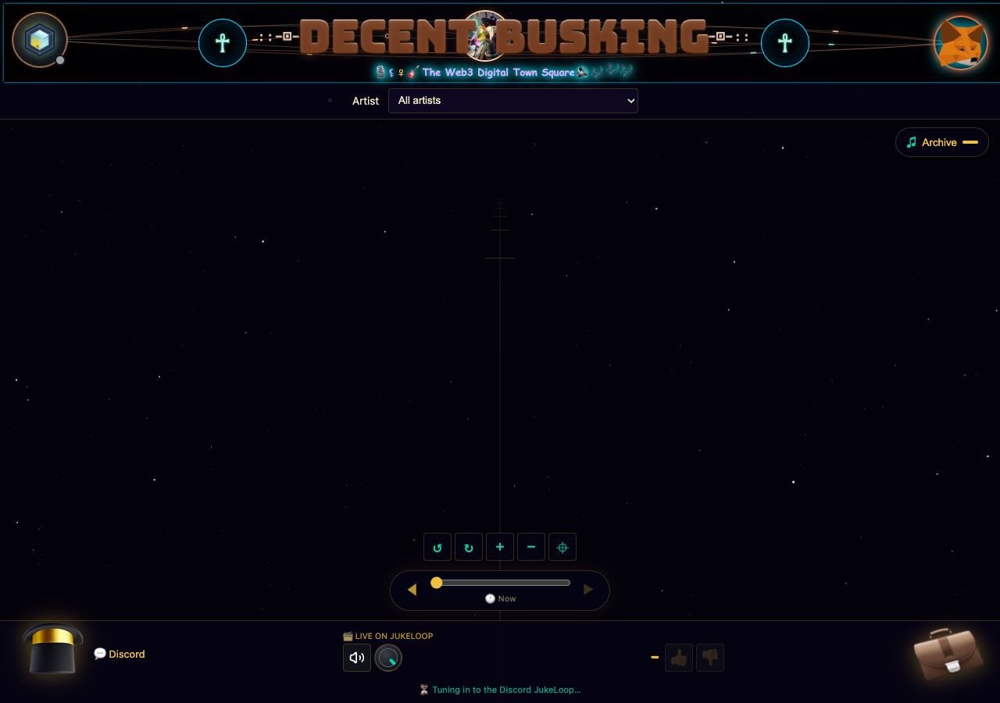
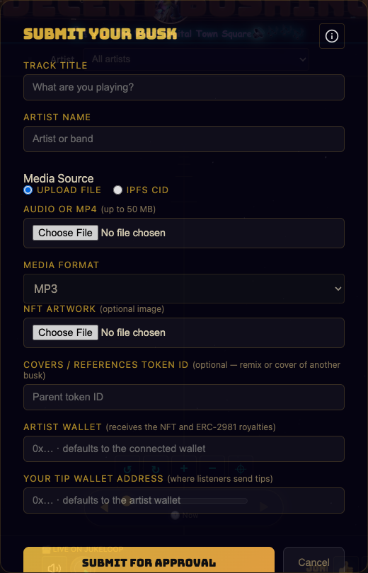
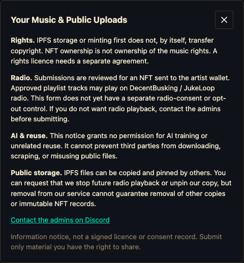

# Your First Visit To DecentBusking

Start here: [open DecentBusking](https://thejollylama.github.io/DecentBusking/). You can listen and explore without connecting a wallet. Take the listener route first; submit a song only when you are ready to share it publicly.

## Three Names, One Community

| Name | What you are looking at |
| --- | --- |
| **DecentBusking** | The website: live radio, the music NFT archive, artist tips, submissions, and playback tallies. |
| **#DecentJukebox** | The Discord channel where artists post songs and the bot handles upload and NFT-request replies. |
| **JukeLoop** | The ongoing community radio rotation in Discord voice, synchronized to the website's radio. |

An NFT is a token referring to a song and its metadata. Owning or minting the token does not, by itself, transfer copyright or grant music-use rights.

## 1. Listen First

Look at the **bottom radio bar**. It shows the current song and artist when JukeLoop is playing.

The screenshot shows the first-load view while the archive and radio are loading. Song artwork and the current track will change; a star field alone does not mean you need to connect a wallet.

1. Click **Tune in** if it appears. Browsers can require a click before sound starts.
2. Use the **speaker button** to mute or unmute, and the **volume control** beside it to adjust the radio.
3. If you see a between-tracks or reconnecting message, wait for the next track. Repeated clicks will not manufacture a live stream.

**You have reached this step when:** you can hear the current track and recognize its title and artist. No wallet or payment is required.

## 2. Vote On What Is Playing

Click **thumbs up** or **thumbs down** in the bottom radio bar while a track is active. Disabled voting buttons mean there is no eligible current play yet. The site accepts one vote per browser for that play, not a new vote for every click.

Votes influence the radio rotation. New Top 10 prize drafts use weekly net votes, but prizes need a funded budget and owner review. A vote is not a payment or a guarantee of earnings.

**You have reached this step when:** the vote control acknowledges your choice.

## 3. Meet A Song And Its Artist

Select a music NFT in the **3D music space / archive**. Inspect its song details and artwork. Selecting an archive recording is different from listening to the live radio: use **Radio** in the bottom bar to return to JukeLoop.

Click **Archive** near the upper-right of the music space for the song list, or use the **Artist** selector below the header to focus on one artist. Wait for metadata to load if the archive is initially empty.

The **hat** opens the tip form. A tip is a real wallet payment, not a free interaction. Check the destination, token, amount, network, and wallet fees before confirming. You do not need to send a tip to keep exploring.

The **Left Ankh** at the top opens the public **Playback Tally**. This is the whole station's activity, not just your songs. Admin and Payroll entries are owner tools; ordinary listeners do not need them.

**You have reached this step when:** you can tell the difference between an archive song, the live radio, and the public tally.

## 4. Bring One Song

Choose one route. Do not submit the same song twice just because owner review takes time.

### Website Route

1. Click the **guitar case** to open **Submit Your Busk**.
2. Click the little **i** beside the heading and read **Your Music & Public Uploads** before choosing a file.
3. Connect your artist wallet using the **wallet control at the top-right**, then return to the guitar-case form. Artist actions use Base.
4. Enter the **Track Title** and **Artist Name**. Choose **Upload file** for audio or MP4 up to 50 MB, or **IPFS CID** for an already-pinned file. A CID is not a folder path or a gateway URL; select the correct media format in CID mode.
5. Artwork is optional. Check **Artist Wallet**: that is where the approved NFT will go. The **Tip Wallet** can be different; check it too. Referencing another token does not grant permission to use someone else's song.
6. Click **Submit for Approval**. Wallet signatures authorize the upload/submission; read each prompt. This is not the owner's mint transaction.
7. Look for **Queued for owner approval** and the IPFS CID. Keep the CID and wait for review rather than repeatedly submitting.

**You have reached this step when:** the form says the song is queued. The artist request does not mint automatically, promise radio scheduling, or guarantee a payout. The owner reviews and pays gas for an approved mint sent to the chosen artist wallet.

The NFT's royalty setting describes a royalty request to compatible marketplaces, not guaranteed income or copyright ownership.

### Discord Route

1. [Join Discord](https://discord.gg/SCtcBggHPa) and open **#DecentJukebox**.
2. Post one supported audio or MP4 attachment, up to 10 MB for this bot's attachment flow.
3. Read the bot reply and click **Request NFT** when offered. Enter your Base artist wallet and optional artwork as prompted.
4. Wait for owner review and the mint confirmation reply. Discord upload/playback and an NFT request are distinct steps; ask the admins before posting if you do not want your song played on radio.

To hear the Discord radio, join the **JukeLoop voice channel**. If an attachment is too large, use the website's upload or existing-file-CID route instead.

## Public Uploads: Know The Limits

IPFS files can be downloaded, copied, and pinned by others. The information notice grants no AI-training permission, but cannot stop third-party scraping or guarantee that all public copies can be removed. The current form has no separate radio-consent or opt-out checkbox. If you do not want radio playback, contact the admins before submitting.

You can request that we stop future playlist playback or unpin our copy; that does not guarantee erasing other people's copies or immutable NFT records. This notice is information, not a signed licence or consent agreement. Share only material you have the right to share.

## 5. Find Your Own Songs And Counts

1. Connect the **same artist wallet used to receive your music NFT**.
2. Click the **Right Ankh** at the top-right of the title.
3. Choose **My Playbacks**. This opens **My Playback Tally**, filtered to the connected artist wallet.
4. Start with **All Time**, then choose a UTC week to inspect qualified weekly plays. Use song, artist, and upload-date filters to narrow the list.

The song rows show **Plays**, **Likes**, and **Dislikes**. Those like/dislike columns are lifetime totals even when you select a week. Playback payroll uses qualified weekly plays; Top 10 prize calculations separately use new weekly net-vote buckets. Weekly buckets start fresh on Monday UTC while lifetime totals remain.

**You have reached this step when:** you can find your own song and distinguish its lifetime activity from the selected week's qualified plays. If the list is empty, check the wallet, the date/search filters, and **All Time** first. Counts are not a withdrawable balance; owner-reviewed payments need a funded budget.

## When Something Does Not Match

If you cannot hear the radio, check **Tune in**, mute, volume, and whether a track is actually live. If an upload is queued, wait for the owner rather than re-uploading. If a song or NFT is missing, keep the CID, artist wallet, and any confirmation transaction link, then [ask the admins on Discord](https://discord.gg/SCtcBggHPa). Never send anyone your seed phrase or private key.

You now know the loop: **artist shares a song -> owner reviews an NFT request -> approved music appears in the archive and may join radio -> listeners hear and vote -> tallies record activity -> funded, reviewed payouts are a separate step.**